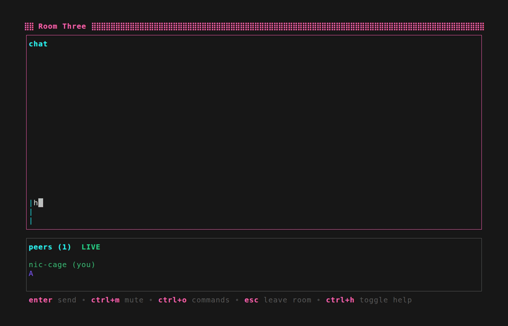
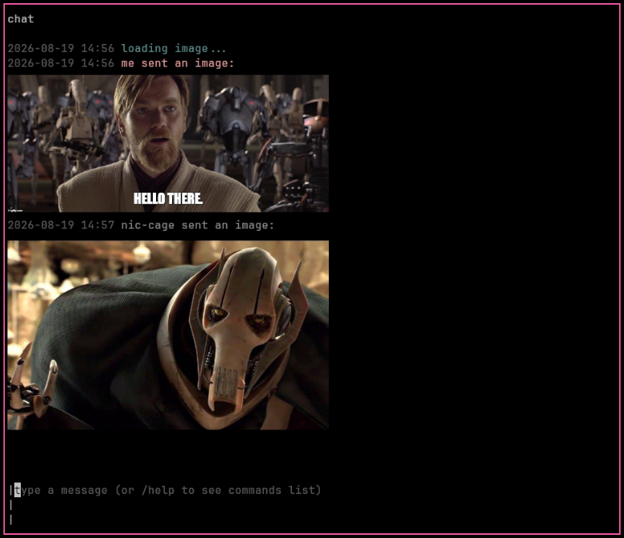

# skulls

A terminal-based voice/text chat app. Rooms are hosted by a signaling server, which peers use to exchange WebRTC offers/answers/ICE (Interactive Connectivity Establishment) candidates and establish a connection — once that handshake completes, audio and messages flows peer-to-peer directly.

  
  

## Components

- [`rtc-client/`](rtc-client/) — the TUI client (Bubble Tea + Lipgloss + WebRTC via pion, malgo for audio I/O, opus for encoding)
- [`signaling-server/`](signaling-server/) — WebSocket signaling + REST API server

See each directory's README for setup and usage.

## Updates

### Image sharing in chat

The `/image` command shares a local file or http(s) URL image, rendered inline via the kitty graphics protocol ([bubblekitten](https://github.com/arthursfares/bubblekitten)) — this requires a terminal that supports the protocol.

  

